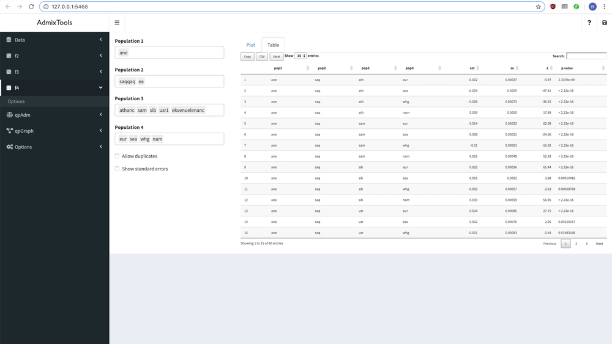

<!-- README.md is generated from README.Rmd. Please edit that file --->

# ADMIXTOOLS 2

A new, lightning fast implementation of
[*ADMIXTOOLS*](https://github.com/DReichLab/AdmixTools).

The corresponding manuscript is finally online
[here](https://elifesciences.org/articles/85492)! My personal summary
and a few more thoughts can be found
[here](https://uqrmaie1.github.io/admixtools/articles/paper.html).

**Contacts:** For questions, please contact either [Pavel
Flegontov](mailto:pavel_flegontov@hms.harvard.edu), [Robert
Maier](mailto:robertmaier@gmx.net) or [Ulas
Isildak](mailto:isildak.ulas@gmail.com).

## Overview

*ADMIXTOOLS* is a collection of programs which use genetic data to infer
how populations are related to one another. It has been used in
countless publications to test whether populations form clades
(*qpDstat*, *qpWave*), to estimate ancestry proportions (*qpAdm*), and
to fit admixture graphs (*qpGraph*).

*ADMIXTOOLS 2* provides the same functionality as *ADMIXTOOLS* in a new
look, and it’s orders of magnitude faster. This is achieved through
separating the computation of *f*<sub>2</sub>-statistics from all other
computations, and through a number of other optimizations. In the
example below, rendering the plot takes much longer than computing the
fit of a new *qpGraph* model:


## Features

-   Much faster than the original *ADMIXTOOLS* software
-   Simple R command line interface
-   Even simpler point-and-click interface
-   Several new features and methodological innovations that make it
    easier to find robust models:
    -   [Automated and semi-automated admixture graph
        inference](html#exploring-different-graphs-1)
    -   Simultaneous exploration of many *qpAdm* models
    -   Unbiased comparison of any two *qpGraph* models using
        out-of-sample scores
    -   Jackknife and bootstrap standard errors and confidence intervals
        for any *qpAdm*, *qpWave*, and *qpGraph* parameters
    -   Interface with *msprime* makes it easy to
        [simulate](https://uqrmaie1.github.io/admixtools/articles/graphs.html#simulating-under-an-admixture-graph-1)
        genetic data under an admixture graph
-   Full support for genotype data in *PACKEDANCESTRYMAP/EIGENSTRAT*
    format and *PLINK* format
-   Wrapper functions around the original *ADMIXTOOLS* software (see
    also [admixr](https://bodkan.net/admixr/index.html))
    <!-- * Simple interface with [msprime](https://msprime.readthedocs.io/en/stable/index.html) for simulating under a given admixture graph -->
-   [Extensive
    documentation](https://uqrmaie1.github.io/admixtools/articles/admixtools.html)
-   New features available [on
    request](mailto:rmaier@broadinstitute.org)!

## Installation

``` r
install.packages("devtools") # if "devtools" is not installed already
devtools::install_github("uqrmaie1/admixtools")
library("admixtools")
```

The above commands will install all R package dependencies which are
required to run *ADMIXTOOLS 2* on the command line. For the interactive
app, additional packages are required, which can be installed like this:

``` r
devtools::install_github("uqrmaie1/admixtools", dependencies = TRUE)
```

If you encounter any problems during the installation, this is most
likely because some of the required R packages cannot be installed. If
that happens, try manually re-installing some of the larger packages,
and pay attention to any error message:

``` r
install.packages("Rcpp")
install.packages("tidyverse")
install.packages("igraph")
install.packages("plotly")
```

Running `devtools::install_github("uqrmaie1/admixtools")` will compile
C++ from source code (this isn’t necessary when installing packages from
CRAN with `install.packages()`).

If you get the following error:

`Error: Failed to install 'admixtools' from GitHub:  Could not find tools necessary to compile a package.`

you might be able to solve the problem by installing
[Rtools](https://cran.r-project.org/bin/windows/Rtools/) for your
version of R if you use Windows, or [Xcode command line
tools](https://developer.apple.com/download/more/) if you use macOS.
This is also described
[here](https://r-pkgs.org/setup.html#setup-tools).

On some Linux distributions, it may be necessary to manually install
additional libraries or programs. For example, if you see the error
`gfortran: command not found` during installation, you would have to
install `gfortan` with `sudo zypper in gfortran` or
`sudo apt-get install gfortran`, depending on the Linux distribution.

If you get any other errors during installation, please [contact
me](mailto:robertmaier@gmx.net).

## Usage

Admixture graphs can be fitted like this:

``` r
genotype_data = "/my/geno/prefix"
fit = qpgraph(genotype_data, example_graph)
fit$score
```

    #> [1] 19219.98

``` r
plot_graph(fit$edges)
```

 Clearly not a historically
accurate model, but it gets the idea across.

<br>

When testing more than one model, it makes sense to extract and re-use
f2-statistics:

``` r
f2_blocks = f2_from_geno(genotype_data)
fit = qpgraph(f2_blocks, example_graph)
```

``` r
fit$score
#> [1] 19219.98
```

<br>

*f*<sub>2</sub>-statistics can also be used to estimate admixture
weights:

``` r
left = c("Altai_Neanderthal.DG", "Vindija.DG")
right = c("Chimp.REF", "Mbuti.DG", "Russia_Ust_Ishim.DG", "Switzerland_Bichon.SG")
target = "Denisova.DG"
```

``` r
qpadm(f2_blocks, left, right, target)$weights
```

    #> # A tibble: 2 × 5
    #>   target      left                 weight    se     z
    #>   <chr>       <chr>                 <dbl> <dbl> <dbl>
    #> 1 Denisova.DG Altai_Neanderthal.DG   49.6  23.3  2.13
    #> 2 Denisova.DG Vindija.DG            -48.6  23.3 -2.08

<br>

Or to get *f*<sub>4</sub>-statistics:

``` r
f4(f2_blocks)
```

    #> # A tibble: 105 × 8
    #>    pop1                 pop2        pop3  pop4      est      se      z         p
    #>    <chr>                <chr>       <chr> <chr>   <dbl>   <dbl>  <dbl>     <dbl>
    #>  1 Altai_Neanderthal.DG Chimp.REF   Deni… Mbut…  0.0196 6.07e-4   32.4 1.32e-229
    #>  2 Altai_Neanderthal.DG Denisova.DG Chim… Mbut… -0.0129 3.64e-4  -35.6 2.22e-277
    #>  3 Altai_Neanderthal.DG Mbuti.DG    Chim… Deni… -0.0326 5.22e-4  -62.5 0        
    #>  4 Altai_Neanderthal.DG Chimp.REF   Deni… Russ…  0.0180 6.87e-4   26.3 6.43e-152
    #>  5 Altai_Neanderthal.DG Denisova.DG Chim… Russ… -0.0152 4.46e-4  -34.0 4.67e-254
    #>  6 Altai_Neanderthal.DG Russia_Ust… Chim… Deni… -0.0332 5.55e-4  -60.0 0        
    #>  7 Altai_Neanderthal.DG Chimp.REF   Deni… Swit…  0.0181 6.63e-4   27.3 1.09e-164
    #>  8 Altai_Neanderthal.DG Denisova.DG Chim… Swit… -0.0150 4.64e-4  -32.3 6.06e-229
    #>  9 Altai_Neanderthal.DG Switzerlan… Chim… Deni… -0.0331 5.74e-4  -57.7 0        
    #> 10 Altai_Neanderthal.DG Chimp.REF   Deni… Vind… -0.0771 6.98e-4 -110.  0        
    #> # … with 95 more rows

## Interactive browser app

*ADMIXTOOLS 2* also has a simple point-and-click interface. This makes
it easy to explore many *qpAdm* or *qpGraph* models at the same time,
for example by allowing you to build and change admixture graphs
interactively. Typing the following command in the R console launches
the app:

``` r
run_shiny_admixtools()
```



## Documentation

One of the design goals behind *ADMIXTOOLS 2* is to make the algorithms
more transparent, so that the steps leading from from genotype data to
conclusions about demographic history are easier to follow.

To this end, all *ADMIXTOOLS 2* functions are
[documented](https://uqrmaie1.github.io/admixtools/reference/index.html).
You can also take a look at the [tutorial](articles/admixtools.html),
read more about how *ADMIXTOOLS 2* computes
[f-statistics](https://uqrmaie1.github.io/admixtools/articles/fstats.html)
and [standard
errors](https://uqrmaie1.github.io/admixtools/articles/resampling.html),
and what you can do with [admixture
graphs](https://uqrmaie1.github.io/admixtools/articles/graphs.html).

For even greater transparency, many of the core functions are
implemented twice: In C++ for performance (used by default), and in R,
which makes it easier to trace the computations step by step. For
example, if you want to know how weights are computed in `qpadm()`, you
can type `qpadm` in R to get the function code and you will see another
function which is called `qpadm_weights()`. By default, this function
will be replaced by its faster C++ version `cpp_qpadm_weights()`. But
you can still see what it’s doing without reading the C++ code by typing
`admixtools:::qpadm_weights`. And you can tell `qpadm()` to use the R
versions instead of the C++ versions by calling `qpadm(cpp = FALSE)`.

## Contact

For questions, feature requests, and bug reports, please contact Robert
Maier under <robertmaier@gmx.net>.

## Acknowledgments

Nick Patterson has developed the original *ADMIXTOOLS* software. David
Reich and Nick Patterson have not only conceived most of the ideas that
have made *ADMIXTOOLS* so successful, they have also provided me (and
continue to provide me) with critical ideas and feedback in the
development of *ADMIXTOOLS 2*.

I also want to thank all members of the Reich lab for many discussions
which have helped me gain a better understanding of the underlying
methods, and for crucial feedback about *ADMIXTOOLS 2*; in particular
Pavel Flegontov, Iosif Lazaridis, Mark Lipson, Harald Ringbauer, Shop
Mallick, and Tian Chen Zeng.

Many useful features in *ADMIXTOOLS 2* were suggested by its users. If
you are able to install and run *ADMIXTOOLS 2* without issues, it is
only because others have cleared the path for you, by bringing problems
to my attention. In no particular order, I want to thank Ornob Alam,
Ming-Shan Wang, Angad Johar, Ezgi Altınışık, Tobias Göllner, Christian
Huber, Kale, Ted Kandell, Fraser Combe, Matthew Williams, Lenny Dykstra,
Kristján Moore, Dilawer Khan, Lareb Humayoun, Sánta Benedek, Steven
Rosenberg, Daniel Tabin, Benjamin Peter, and Ahmad Bekhit.

If you expected to see your name here but I failed to include it, please
let me know about it!

## Cite *ADMIXTOOLS 2*

The *ADMIXTOOLS 2* manuscript is published and can be found
[here](https://elifesciences.org/articles/85492). You should cite it as:

Robert Maier, Pavel Flegontov, Olga Flegontova, Ulas Isildak, Piya
Changmai, David Reich (2023) **On the limits of fitting complex models
of population history to f-statistics** *eLife* 12:e85492

<https://doi.org/10.7554/eLife.85492>

## See also

-   [ADMIXTOOLS](https://github.com/DReichLab/AdmixTools) The original
    *ADMIXTOOLS* software
-   [admixr](https://bodkan.net/admixr/index.html) An R package with
    *ADMIXTOOLS* wrapper functions and many useful tutorials
-   [admixturegraph](https://github.com/mailund/admixture_graph) An R
    package for automatic graph inference
-   [miqoGraph](https://github.com/juliayyan/PhylogeneticTrees.jl) A
    Julia package for automatic graph inference
-   [MixMapper](http://cb.csail.mit.edu/cb/mixmapper/) Another method to
    infer admixture graphs
-   [TreeMix](https://bitbucket.org/nygcresearch/treemix/wiki/Home)
    Another method to infer admixture graphs
-   [Legofit](http://content.csbs.utah.edu/~rogers/src/legofit/index.html)
    A program to estimate the history of population size, subdivision,
    and gene flow
-   [qpBrute](https://github.com/ekirving/qpbrute) Automated graph
    fitting and Bayes factor calculations
