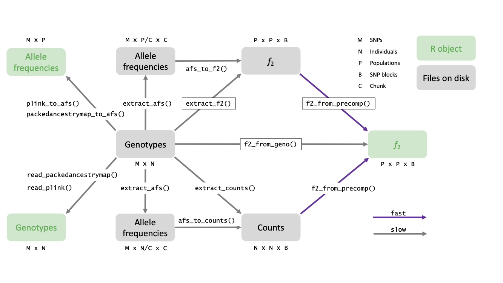

**Under construction**

*f*-statistics are the foundation of *ADMIXTOOLS*. In *ADMIXTOOLS 2*, $f_2$-statistics are of particular importance as $f_3$- and $f_4$-statistics can be computed from $f_2$-statistics. They are conceptually very simple, but estimating them without bias can be complicated.

Here, I give a summary of the basic theory behind *f*-statistics, and practical considerations for estimating them. [The paper which originally introduced *ADMIXTOOLS*](https://www.genetics.org/content/192/3/1065) explains the theory in more detail.

## *f*~2~

$f_2$ is the expected squared difference in allele frequencies between two populations $A$ and $B$.

In the simplest case, we can estimate $f_2$ across $M$ SNPs like this:
$$f_2(A,B) = \frac{1}{M} \sum_{j=1}^M(a_{j} - b_{j})^2 = \frac{1}{M} \sum_{j=1}^M a^2_{j} - 2 a_j b_j + b^2_{j}$$

$f_2$ is closely related to the more widely used pairwise $F_{ST}$. $f_2$ is the genetic variance between populations, and $F_{ST}$ is the ratio of between-population variance ($f_2$) to total variance.

$$F_{ST}(A, B) = \frac{\sigma^2_{between}}{\sigma^2_{between}+\sigma^2_{within}} = \frac{f_2(A,B)}{f_2(A,B) + \frac{1}{M} \sum_{j=1}^M a_j(1-a_j) + b_j (1-b_j)}$$

One reason why *ADMIXTOOLS* uses *f*-statistics and not pairwise $F_{ST}$ is that *f*-statistics are additive: $f_2(A, C) = f_2(A, B) + f_2(B, C)$. This holds under the assumptions that there is a large number of sites, genetic drift is neutral, and there are no backmutations or recurrent mutations.

In contrast, pairwise $F_{ST}$ is not additive. In fact, it doesn't even satisfy the triangle inequality, which means that $F_{ST}(A, C)$ can be greater than $F_{ST}(A, B) + F_{ST}(B, C)$.

On the other hand, $f_2$ has the disadvantage that its expectation depends on the allele frequency spectrum. This can be a problem when combining *f*-statistics from different populations pairs using different SNPs.

<br>

The estimator of $f_2$ shown above will only be unbiased only if we have very accurate estimates of allele frequencies. This is often not the case because allele frequencies are estimated using only few samples in some populations. For this reason, we don't estimate $f_2$ with the simple estimator shown above, but with the following estimator which is robust to changes in sample size:

$$f_2(A, B) = \frac{1}{M} \sum_{j=1}^M (a_j-b_j)^2 - \frac{a_j(1-a_j)}{n_{A,j}-1} - \frac{b_j(1-b_j)}{n_{B,j}-1}$$
$n_{A,j}$ and $n_{B,j}$ are the counts of independently sampled alleles in popoulations $A$ and $B$ at SNP $j$. See [Biases] for more information.


## *f*~4~

$f_4$ is the covariance of allele frequency differences between two pairs of populations. It can also be expressed as a sum of $f_2$-statistics:

$$
\begin{equation}
\begin{aligned}
f_4(A, B; C, D) &= \frac{1}{M}\sum_{j=1}^M(a_{j} - b_{j})(c_{j} - d_{j}) \\ &= \frac{1}{M} \sum_{j=1}^M(- a_j d_j - b_j c_j + a_j c_j + b_j d_j) \\ &= \frac{1}{2M} (\sum_{j=1}^M(a_j - d_j)^2 + \sum_{j=1}^M(b_j - c_j)^2 - \sum_{j=1}^M(a_j - c_j)^2 - \sum_{j=1}^M(b_j - d_j)^2) \\ &= \frac{1}{2}(f_2(A, D) + f_2(B, C) - f_2(A, C) - f_2(B, D) )
\label{eq:f42}
\end{aligned}
\end{equation}
$$

This shows that $f_4$ is at the same time

* the covariance of allele frequency differences (line 1),
* a sum of allele frequency products (line 2), and
* a sum of $f_2$ statistics (line 4).

By comparing the definitions of $f_4$ and $f_2$, we also see that $f_4$ is a generalization of $f_2$: $f_4(A, B; A, B) = f_2(A, B)$


*D*-statistics differ from $f_4$ only by a scaling factor: 
$$
\begin{equation}
\begin{aligned}
D(A, B; C, D) &= \frac{P(ABBA) - P(BABA)}{P(ABBA) + P(BABA)} \\
&= \frac{\frac{1}{M} \sum_{j=1}^M ((1-a_j)b_jc_j(1-d_j) + a_j(1-b_j)(1-c_j)d_j) - (a_j(1-b_j)c_j(1-d_j) + (1-a_j)b_j(1-c_j)d_j)}{\frac{1}{M} \sum_{j=1}^M ((1-a_j)b_jc_j(1-d_j) + a_j(1-b_j)(1-c_j)d_j) + (a_j(1-b_j)c_j(1-d_j) + (1-a_j)b_j(1-c_j)d_j)} \\
&= \frac{f_4(A, B; C, D)}{\frac{1}{M} \sum_{j=1}^M (a_j + b_j - 2 a_j b_j)  (c_j + d_j - 2 c_j d_j)}
\end{aligned}
\end{equation}
$$
Here, $P(ABBA)$ is the probability of observing the same allele in populations $A$ and $D$, and a different one in $B$ and $C$, and $P(BABA)$ is the probability of observing the same allele in populations $A$ and $C$, and a different one in $B$ and $D$.

Naively one might think that estimating $f_4$ without bias is at least as difficult as estimating $f_2$ without bias, but that is not the case. Since each population is represented in $f_4$ through two $f_2$ terms of opposite sign, many biases that are specific to one population will cancel out. This also applies to the low allele count correction factor $\frac{p(1-p)}{n-1}$, which is not necessary when estimating $f_4$.

For a visual interpretation of this effect, consider the following phylogeny:

```
A         B
 \_______/
 /       \
C         D
```

$f_2$ is the total branch length between any two populations, while $f_4(A, B; C, D)$ is the length of the horizontal line. Any increase or decrease in the length of one of the terminal branches - say for example the branch leading to $D$ - will equally affect $f_2(A, D)$, $f_2(B, D)$, and $f_2(C, D)$. But it will not affect $f_4(A, B; C, D)$ - the horizontal line. This robustness is a major strength of methods based on $f_4$-statistics (and to a large extent also of $f_3$-based methods): Terminal branch lengths are affected by many factors such as divergence time, changes in population size, as well as by data quality, but in expectation, none of this affects $f_4$, the covariance of allele freuquency differences.


## Biases

The default options in *ADMIXTOOLS 2* are chosen so that the chances of introducing bias are minimized. In many cases this means that only few SNPs will be used, and not all available information is utilized. If you think this is the case in your analyses, you can change the default settings. This section is intended to describe some of the trade-offs involved and to help you figure out how you can safely make most use of your data, while avoiding false positive results.

There are at least three potential sources of bias in the estimation of *f*-statistics:

[1. Bias due to inaccurate allele frequency estimates](#bias-due-to-inaccurate-allele-frequency-estimates)
    
  This has a solution which works very well in most cases and therefore usually doesn't require much consideration.
    
[2. Bias due to missing data](#bias-due-to-missing-data)
    
  This can be a problem when dealing with populations with lots of missing data, and involves a tradeoff between the [type I and type II error rate](https://en.wikipedia.org/wiki/Type_I_and_type_II_errors).
    
[3. Bias due to SNP ascertainment](#bias-due-to-snp-ascertainment)

  This doesn't seem to be a major problem in practice, but it's good to know about it.
    

### Bias due to inaccurate allele frequency estimates

If we estimate allele frequencies in two populations, and if there is random error, or noise, in the estimates of each population, this noise will lead to an over-estimation of $f_2$, the genetic distance between the two populations.

The most common reason for noisy allele frequency estimates are low sample counts (or a low number of independently sampled alleles). There is a good reason why low sample counts lead to an overestimation of the genetic distance between two populations: One way to immediately go from a single homogeneous population to two highly divergent populations is to take two different, small, random samples, creating two different population bottlenecks. This will tend to push alleles randomly to either end of the allele frequency spectrum. This effect is the same regardless of whether it is caused by actual population bottlenecks, or by the experimental random sampling of a few samples from a population.
If it is caused by experimental random sampling, it is usually desirable to correct for the resulting upward bias in the estimated genetic distance. The upward bias due to a low sample count at a single SNP in one population is $\frac{p(1-p)}{n-1}$, where $p$ is the allele frequency and $n$ is the number of independently sampled alleles. Therefore, an unbiased estimate of $f_2$ at a single SNP is given by

$$f_2(A, B) = (a-b)^2 - \frac{a(1-a)}{n_A-1} - \frac{b(1-b)}{n_B-1}$$
Population-wide estimates of $f_2$ are again averages over all SNPs.
In most cases, $n$, the number of independently sampled alleles, will be twice the number of samples, with two exceptions:

1. Pseudohaploid data

    Many ancient DNA data sets don't call heterozygous genotypes in order to avoid a number of biases. If two different alleles are observed in one sample at a particular site, one of the two alleles is chosen at random and the genotype is declared homozygous for that allele.
    In pseudohaploid samples, the number of independently sampled alleles is therefore equal to the number of samples.


2. Inbreeding

    If an individuals has closely related parents, his or her two parental chromosomes are more similar to each other than two chromosomes sampled at random from the population. In a population in which inbreeding is common, $n$ can therefore be less than two.

Some of the programs in the original *ADMIXTOOLS* have an `inbreed` option which uses an estimator of $f_2$ that is robust to inbreeding. This option is also recommended to use for pseudohaploid data.
*ADMIXTOOLS 2* automatically detects pseudohaploid samples by checking if any heterozyous genotypes are observed among the first 1000 SNPs. If not, the sample is assumed to be pseudohaploid.


### Bias due to missing data

If everything you have read about *f*-statistics thus far gave you the impression that the theory behind *f*-statistics has a certain elegance, it is probably because no one has mentioned missing data. In practice, not all SNPs are present in all samples, and this makes things much more complicated than they otherwise would be. Consider two simple examples:

First, imagine that we have four populations, $A$, $B$, $C$, and $D$, and we are just interested in $f_4(A,B; C,D)$. Let's say that all populations have very low coverage, and there are no SNPs for which we have allele frequency estimates for more than two of the four populations at the same time. Since $f_4(A,B; C,D) = \frac{1}{2}(f_2(A, D) + f_2(B, C) - f_2(A, C) - f_2(B, D) )$, it might still be possible to estimate $f_4(A,B; C,D)$.

However, this equation is only correct if all *f*-statistics are estimated on the same SNPs. It is still correct in expectation if the missing SNPs are missing at random - if there is no relation between a SNP's presence or absence in one population, and some other property, such as its allele frequency, in another population. Unfortunately, this is often not the case.

Next, consider a model of five populations, $A$, $B$, $C$, $D$, and $E$ in which we want to use two $f_4$-statistics, $f_4(A,B; C,D)$ and $f_4(A,B; C,E)$. Now imagine that $D$ and $E$ have very low coverage, so that no SNPs were genotyped both in $D$ and in $E$. We would have no problem computing each $f_4$-statistic individually: For each of the two we would select the SNPs that are present in all four populations. However, the two $f_4$-statistics would be computed on completely different SNPs (only those present in $D$ vs only those present in $E$), which raises the question whether it is OK to use both $f_4$-statistics in the same model.

The two scenarios are illustrated for SNPs with different missingness patterns in the tables below.

<br>

There are different solutions to these problems. Most of them involve choosing specific sets of SNPs:

1. Using only SNPs present in all populations in a given analysis
2. Using only SNPs present in all four populations of any given $f_4$-statistic
3. Excluding SNPs or populations with high levels of missingness
4. Using allele frequency products rather than $f_2$-statistics to compute $f_4$-statistics

These options fall along a gradient that ranges from very conservative - using fewer SNPs and thus having less power, minimizing the chance of false positive results - to less conservative - using all SNPs that are informative, at cost increasing the chance of false positive results. They are discussed individually below. Which of this solutions is most suitable in your case depends on a few different factors:

* If most of your samples have few missing SNPs, you will not loose much power by using the first, most conservative option.
* If there is lots of missingness, but you have reason to believe that SNPs are missing more or less at random, it can be safe to use the less conservative options. This could be the case if, for example, all populations were genotyped using the same technology, and if there are no associations between missingness in one population, and allele frequency in another population.
* Some analyses are more sensitive to these kinds of biases than others. Generally speaking, hypothesis tests can be more sensitive than parameter estimates. For example, when choosing the least conservative option, it is possible that most *f*-statistics are estimated fairly accurately, and that they can be used without problems to estimate the fit of an admixture graph. However, a fairly accurate estimate of an $f_4$-statistic which should be zero can deviate from zero by an amount which is both small, and highly significant. This means that more caution is necessary when using `qpdstat()` or `qpadm()`, than when using `qpgraph()`.
* If there is doubt about which of the options above is right in your case, try them all and check if the results differ. If yes, it could be that you don't have enough non-missing data to get an unambiguous answer. If the results are mostly the same, you can be more confident that the choice of SNPs doesn't matter much.


<br>

<center>

|               |          A    |          B    |          C    |          D    |     maxmiss = 0     (default)    |     maxmiss = 1    |
|---------------|---------------|---------------|---------------|---------------|:--------------------------------:|:------------------:|
|     SNP1     |     1         |     1         |     1         |     1         |                 <span style="color:green">✓</span>                |          <span style="color:green">✓</span>         |
|     SNP2     |     1         |     <span style="color:grey">0</span>         |     1         |     <span style="color:grey">0</span>         |                 <span style="color:red">✗</span>                |          <span style="color:green">✓</span>         |
|     SNP3     |     1         |     <span style="color:grey">0</span>         |     <span style="color:grey">0</span>         |     1         |                 <span style="color:red">✗</span>                |          <span style="color:green">✓</span>         |
|     SNP4     |     <span style="color:grey">0</span>         |     1         |     <span style="color:grey">0</span>         |     1         |                 <span style="color:red">✗</span>                |          <span style="color:green">✓</span>         |
|     SNP5     |     <span style="color:grey">0</span>         |     1         |     1         |     <span style="color:grey">0</span>         |                 <span style="color:red">✗</span>                |          <span style="color:green">✓</span>         |
|     SNP6     |     1         |     1         |     1         |     <span style="color:grey">0</span>         |                 <span style="color:red">✗</span>                |          <span style="color:green">✓</span>         |
|     SNP7     |     <span style="color:grey">0</span>         |     1         |     1         |     1         |                 <span style="color:red">✗</span>                |          <span style="color:green">✓</span>         |
|     SNP8     |     1         |     1         |     <span style="color:grey">0</span>         |     <span style="color:grey">0</span>         |                 <span style="color:red">✗</span>                |          <span style="color:red">✗</span>         |
|     SNP9     |     <span style="color:grey">0</span>         |     <span style="color:grey">0</span>         |     1         |     1         |                 <span style="color:red">✗</span>                |          <span style="color:red">✗</span>         |
|     SNP10    |     1         |     <span style="color:grey">0</span>         |     <span style="color:grey">0</span>         |     <span style="color:grey">0</span>         |                 <span style="color:red">✗</span>                |          <span style="color:red">✗</span>         |

</center>

**SNPs which contribute to an estimate of $f_4(A,B; C,D)$ under different settings. Missing SNPs are denoted by 0, non-missing SNPs by 1.**


<br>

|         |          A    |          B    |          C    |          D    |          E    |          $f_4(A,B; C,D)$    |          $f_4(A,B; C,E)$    |     1: maxmiss   = 0    |     2: allsnps    |     3: maxmiss   = 1    |
|-|-|-|-|-|-|:-:|:-:|:-:|:-:|:-:|
|     SNP1    |     1    |     1    |     1    |     1    |     1    |     1/2/3    |     1/2/3    |     <span style="color:green">✓</span>    |     <span style="color:green">✓</span>    |     <span style="color:green">✓</span>    |
|     SNP2    |     1    |     1    |     1    |     1    |     <span style="color:grey">0</span>    |     2/3    |     3    |     <span style="color:red">✗</span>    |     <span style="color:green">✓</span>    |     <span style="color:green">✓</span>    |
|     SNP3    |     1    |     1    |     1    |     <span style="color:grey">0</span>    |     1    |     3    |     2/3    |     <span style="color:red">✗</span>    |     <span style="color:green">✓</span>    |     <span style="color:green">✓</span>    |
|     SNP4    |     1    |     1    |     <span style="color:grey">0</span>    |     1    |     1    |     3    |     3    |     <span style="color:red">✗</span>    |     <span style="color:red">✗</span>    |     <span style="color:green">✓</span>    |
|     SNP5    |     1    |     1    |     1    |     <span style="color:grey">0</span>    |     <span style="color:grey">0</span>    |     3    |     3    |     <span style="color:red">✗</span>    |     <span style="color:red">✗</span>    |     <span style="color:green">✓</span>    |
|     SNP6    |     <span style="color:grey">0</span>    |     <span style="color:grey">0</span>    |     1    |     1    |     1    |    -     |     -    |     <span style="color:red">✗</span>    |     <span style="color:red">✗</span>    |     <span style="color:red">✗</span>    |

**SNPs which contribute to a model which uses two $f_4$-statistics, $f_4(A,B; C,D)$ and $f_4(A,B; C,E)$. The numbers in the $f_4$ columns indicate under which of the three settings each SNP contributes to each $f_4$-statistic.**

<br>

What follows are more detailed descriptions of the different strategies for dealing with missing data, and their implementations in *ADMIXTOOLS* and in *ADMIXTOOLS 2*.

1. Using only SNPs present in all populations in a given analysis
    
    This is the most conservative option, and it is the default in both *ADMIXTOOLS* (where it corresponds to `allsnps: NO`) and *ADMIXTOOLS 2* (where it corresponds to `maxmiss = 0`). The downside of this option is that few SNPs may remain, especially in models with many populations (or when extracting $f_2$-statistics for many populations).
    
2. Using only SNPs present in all populations of any given *f*-statistic

    This option uses different SNPs for different *f*-statistics and therefore often uses more SNPs in total than the first option. It requires for each $f_3$-statistic and $f_4$-statistic that the SNPs be present in all three or four populations, respectively. In *ADMIXTOOLS* this corresponds to `allsnps: YES`.
    As the set of SNPs used in this option can be different for every *f*-statistic, and pre-computed $f_2$-statistics are calculated on a fixed set of SNPs for every population pair, pre-computed $f_2$-statistics can't be used for this option. Because of this, many *ADMIXTOOLS 2* functions can read data directly from genotype files and have an `allsnps` argument which can be `TRUE` or `FALSE`. Reading data directly from genotype files is slower, but makes it possible to choose this option for dealing with missing data.

3. Excluding SNPs or populations with high levels of missingness

    The issues described in this section are only problematic if there is lots of missing data. If you can drop the populations with lots of missing data, that solves the problem. If that's not an option, it might help to exclude SNPs with high missingness. In *ADMIXTOOLS 2*, the default option of `maxmiss = 0` is very conservative in that it excludes all SNPs which are missing in any population. At the opposite extreme, `maxmiss = 1` will not exclude any SNPs, and for each $f_2$-statistic it will use all SNPs that are present in that pair. Generally speaking, values of `maxmiss` closer to 0 are more conservative and will leave you with fewer SNPs, while values closer to 1 make use of more SNPs, but are less conservative.
    It's difficult to give a recommendation on what fraction of missingness is acceptable, because the risk of introducing bias doesn't just depend on the *amount* of missingness, but also on the amount of *structure* in the missingess. When SNPs are missing more or less at random, it is much less of a problem than when it's mostly common or mostly rare SNPs that are missing in some populations. This can occur, for example, when combining data which were genotyped using different technologies.
    

4. Using allele frequency products rather than $f_2$-statistics to compute $f_4$-statistics

    This solution is complementary to the ones mentioned before. If you recall the equation above in which $f_4$ is expressed as a sum of four $f_2$-statistics, you will see that it can be expressed equally as a sum of four allele frequency products (averaged across SNPs). When no SNPs are missing, there is no difference between $f_4$ as a sum of $f_2$ and $f_4$ as a sum of allele frequency products. However, when some SNPs are missing, it is often better to compute $f_4$ as a sum of allele frequency products. This is because the $f_2$ bias correction factor is more influenced by using different sets of SNPs than allele frequency products. In *ADMIXTOOLS 2*, allele frequency products are always extracted from genotype data in parallel with $f_2$-statistics. Functions which directly or indirectly use $f_4$-statistics will automatically use these allele frequency products when reading data from disk. When data from disk is read manually, for example using `f2_from_precomp()`, the option `afprod = TRUE` can be used to read allele frequency products instead of $f_2$-statistics.


### Bias due to SNP ascertainment

The selection of SNPs can introduce bias in a way very similar to missing SNPs. The theory behind *f*-statistics holds when SNPs are ascertained to be heterozygous in an outgroup, and when that is the only ascertainment criterion. This means that any further subsetting, for example to SNPs which are common across a range of populations, or the inclusion of SNPs which are heterozygous in one out of several groups, violates this ascertainment principle.

To see that a very skewed SNP ascertainment has the potential to create arbitrary results, imagine that a particular $f_4$-statistic for four populations is computed for every SNP in the genome. Let's say the true value of that statistic is zero. The per-SNP statistics will still fluctuate widely, and by selecting only the SNPs with positive $f_4$-statistics, or only the SNPs with negative $f_4$-statistics, very significant results in any direction can be obtained.

In practice it is generally not the case that small violations of the strict SNP ascertainment requirements affect the results in a substantial manner. If there is doubt about this, it can help to repeat analyses under different SNP ascertainment schemes.


## *f*-statistics in *ADMIXTOOLS 2*

In *ADMIXTOOLS 2*, the simplest way to compute *f*-statistics from genotype data is to use `f2_from_geno()`.

```{r, echo = FALSE}
library(admixtools)
```

```{r, eval = FALSE}
genotype_data = "/my/geno/prefix"
f2_blocks = f2_from_geno(genotype_data)
```

However, in most cases it will save you time to store $f_2$-statistics on disk in a way that lets you access only some of the population pairs. 


```{r, eval = FALSE}
genotype_data = "/my/geno/prefix"
f2_dir = "/my/f2/directory/"
extract_f2(genotype_data, f2_dir)
f2_blocks = f2_from_precomp(f2_dir, pops = c("pop1", "pop2", "pop3"))
```

In addition to that, there are several more functions which are useful to extract data in a way that doesn't require you to commit to a fixed assignment of individuals to populations (`extract_counts()`), and function which make the process more memory efficient and easier to parallelize in case you want to extract data for a large number of individuals or populations (`extract_afs()`, `afs_to_f2()`, `afs_to_counts()`).

The following schematic gives an overview of these functions:




Arguments to these functions can be used to decide

* For which samples or populations to compute $f_2$-statistics
* Which SNPs to use
  - thresholds for missingness and allele frequency, transitions only, ...
* How SNPs should be grouped into blocks
  - defaults to blocks of 5 centimorgan
* Whether pseudohaploid samples should be detected automatically
  - recommended; can be set to `FALSE` to match the original *ADMIXTOOLS*
  
For example, the folllowing command would extract data for the populations `mypops`, keeping only SNPs which are missing in no more than 10% of the populations, and grouping SNPs into blocks of 10 centimorgan.

```{r, eval = FALSE}
extract_f2(genotype_data, f2_dir, pops = mypops, maxmiss = 0.1, blgsize = 0.1)
```

### Allele frequency products

`extract_f2()` computes and stores both regular $f_2$-estimates, and allele frequency product estimates. In most cases, the allele frequency products will not be needed, but if there is a concern that missing data introduces bias, they can be used for computing f4-statistics and loaded like this: 

```{r, eval = FALSE}
my_f2_dir = '/store/f2data/here/'
afprod_blocks = f2_from_precomp(my_f2_dir, afprod = TRUE)
```

This creates a 3d array just like `f2_blocks`, but it will contain allele frequency products rather than $f_2$-statistics. For any *ADMIXTOOLS* application based on $f_4$-statistics, this allele frequency product array can be used just like the regular $f_2$ array. It will give close to identical results, but without any bias introduced by poor $f_2$-estimates.

Computing allele frequency products is simpler than computing $f_2$ (allele frequency products are a part of $f_2$), but two things need to be done differently to get unbiased estimates:

1. In contrast to $f_2$, for allele frequency products the designation of reference and alternative alleles can make a difference. To get estimates which are independent of that, we average over both options for each SNP. (If the alelle frequencies at a SNP are `0.1` and `0.2` in two populations, we compute
`((0.1 * 0.2) + (0.9 * 0.8))/2` instead of just `0.1 * 0.2`)

2. *ADMIXTOOLS* excludes any SNPs with identical allele frequencies in all populations. This makes very little differences when computing $f_2$, but shouldn't be done for allele frequency products. Because those SNPs are not excluded, the number of SNPs and the number of blocks can be larger for allele frequency products than for $f_2$.


### Extracting *f*~2~ for a large number of populations

It can be very convenient to extract $f_2$-statistics for all your data in the beginning, because once that is done, all other analyses in *ADMIXTOOLS 2* will be relatively fast.

But before you decide to do that, make sure you have thought about whether missing data might be a problem. The default option of excluding all SNPs with missing data in any population might not leave you with enough SNPs. Increasing the `maxmiss` parameter in `extract_f2()` can help, but can potentially introduce bias in populations with lots of missing data.

<br>

By default, `extract_f2()` will keep the allele frequency matrix for all SNPs and populations in memory. If you run out of memory, you can either reduce the number of populations, or set the `cols_per_chunk` argument in `extract_f2()` to a positive integer, for example 10. This will split the allele frequency matrix into chunks and saves each chunk on disk. This is slower, but less memory intensive, and will perform two operations:

1. Saving the allele frequency chunks with `extract_afs()`
2. Computing $f_2$ for each pair of chunks with `afs_to_f2()`


```{r, eval = FALSE}
genotype_data = "/my/geno/prefix"
outdir = "/store/f2data/here/"

# 1st Step
extract_afs(genotype_data, outdir, cols_per_chunk = 10)
numchunks = length(list.files(outdir, 'afs.+rds'))

# 2nd Step
for(j in 1:numchunks) {
  for(j in i:numchunks) {
    afs_to_f2(outdir, outdir, chunk1 = i, chunk2 = j)
  }
}
```

Increasing `cols_per_chunk` in the first step can speed things up, but will require more memory in the second step.
Once `extract_afs()` has finished, $f_2$-statistics can be computed for each pair of chunks.

The second step can take a long time when running one pair after another, so it can make sense to run the calls to `afs_to_f2()` in parallel.


### Extracting *f*~2~ for arbitrary populations

What if you decide that a particular sample should be added or removed from a population? With the approach described so far, you would have to go back to the genotype data to get new estimates of $f_2$ for all pairs of the modified population and any other populations. Even if you had computed $f_2$ for all pairs of individuals (rather than for pairs of populations), it would not be possible to combine the $f_2$ statistics from individual pairs into $f_2$ statistics on population pairs formed from these individuals. It *is* possible, however, to store *other* statistics for all individuals and individual pairs, which can be combined into estimates of $f_2$ for any populations formed from these individuals. These statistics are the mean alternative allele counts (`a`) and total allele counts (`n`) for each individual and block, and the mean products of allele counts for all individual pairs (`aa` and `nn`).

The upside of this approach is that it allows you to change population definitions however you like and still get very fast results without accessing the genotype data more than once. The downside is that it makes it necessary to store data for all individual pairs, rather than just all population pairs. Besides taking more disk space, this also makes it a bit slower to get $f_2$-statistics into R. Another disadvantage is that it makes the missing data problem worse, because SNPs are more likely to be missing in single individuals than in populations comprised of multiple individuals.

The following function extracts data for a set of individuals which can then be combined to get estimates of f2 for any populations:

```{r, echo = FALSE}
library(admixtools)
```

```{r, eval = FALSE}
inds = c('Chimp.REF', 'Altai_snpAD.DG', 'Vindija_snpAD.DG',
         'S_Mbuti-3.DG', 'B_Mbuti-4.DG', 'S_Mbuti-2.DG', 'S_Mbuti-1.DG',
         'Denisova_snpAD.DG', 'UstIshim_snpAD.DG', 'Bichon.SG')
my_counts_dir = 'my/counts/dir'
extract_counts(prefix, my_counts_dir, inds)
```

You can again use `f2_from_precomp()` to load a subset of the extracted data into memory. If the directory you provide contains allele count data rather than $f_2$-statistics, this function will not only read the data, but combine it into $f_2$-statistics for populations that you define. The populations can be defined by providing a vector of individuals and another vector of equal length with population labels.

For example, the following code should return $f_2$-statistics very similar to the $f_2$-statistics in the earlier examples. They will not be exactly identical, because the set of SNPs used and the SNP block boundaries usually differ a little bit when filtering SNPs based on sample and based on population missingness. In addition, some approximations are necessary when computing $f_2$-statistics this way. However, if you fix the set of SNPs with the `keepsnps` argument, the difference should be very small.

```{r, eval = FALSE}
pops = c('Chimp', 'Altai', 'Vindija',
         'Mbuti', 'Mbuti', 'Mbuti', 'Mbuti',
         'Denisova', 'Russia', 'Switzerland')
f2_blocks_v2 = f2_from_precomp(my_counts_dir, inds = inds, pops = pops)
```

It's now easy to test how the inclusion or exclusion of specific samples affects the fit of a model. The following example uses only two Mbuti samples, and combines the two Neanderthal samples into one group.  

```{r, eval = FALSE}
inds_v3 = c('Chimp.REF', 'Altai_snpAD.DG', 'Vindija_snpAD.DG',
            'S_Mbuti-2.DG', 'S_Mbuti-1.DG',
            'Denisova_snpAD.DG', 'UstIshim_snpAD.DG', 'Bichon.SG')
pops_v3 = c('Chimp', 'Neanderthal', 'Neanderthal',
            'Mbuti', 'Mbuti',
            'Denisova', 'Russia', 'Switzerland')
f2_blocks_v3 = f2_from_precomp(my_counts_dir, inds = inds_v3, pops = pops_v3)
```

<br>

This approach is very flexible, but it gets slow when some populations consist of large numbers of samples. If you find yourself in this situation, you can group individuals into populations and store the combined allele count data for those populations on disk. The following example stores a `Mbuti` group on disk, and then uses that group, rather than each sample in it, to compute $f_2$-statistics.

```{r, eval = FALSE}
mbuti = c('S_Mbuti-3.DG', 'B_Mbuti-4.DG', 'S_Mbuti-2.DG', 'S_Mbuti-1.DG')
group_samples(my_counts_dir, mbuti, 'Mbuti')

inds_v4 = c('Chimp.REF', 'Altai_snpAD.DG', 'Vindija_snpAD.DG', 'Mbuti',
            'Denisova_snpAD.DG', 'UstIshim_snpAD.DG', 'Bichon.SG')
f2_blocks_v4 = f2_from_precomp(my_counts_dir, inds = inds_v4)
```

Data from these groups can be deleted like this:

```{r, eval = FALSE}
delete_groups(my_counts_dir, 'Mbuti')
```


<br>


